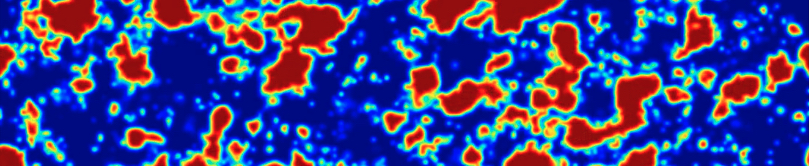

<a name="logo"/>
<div align="left">
</img>
</a>
</div>

# pyc2ray: A flexible and GPU-accelerated radiative transfer framework
`pyc2ray` is the updated version of [C2Ray](https://github.com/garrelt/C2-Ray3Dm/tree/factorization) [(G. Mellema, I.T. Illiev, A. Alvarez and P.R. Shapiro)](https://ui.adsabs.harvard.edu/link_gateway/2006NewA...11..374M/doi:10.48550/arXiv.astro-ph/0508416), an astrophysical radiative transfer code widely used to simulate the Epoch of Reionization (EoR). `pyc2ray` features a new raytracing method developed for GPUs, as well as a modern python interface that allows easy and customizable use of the code without compromising computational efficiency.

The core features of `C2Ray`, written in Fortran90, are wrapped using `f2py` as a python extension module, while the new raytracing library, _ASORA_, is implemented in C++ using CUDA. Both are native python C-extensions and can be directly accessed from any python script.

## Installation
Since the automatic build system isn't fully working yet, the extension modules must be compiled and placed in correct directories manually. After cloning the repository, create the `/lib` directory inside `/pyc2ray/` (from the root of the repository).

**Requirements**:
- C Compiler
- `gfortran` Fortran Compiler
- `nvcc` CUDA compiler
- `f2py` $\geq$ 1.24.4, provided by `numpy`

Additionally, once built, `pyc2ray` requires the `astropy` and `tools21cm` python packages to work.

### 1. Build Fortran extension module (C2Ray)

The tool to build the module is `f2py`, provided by the `numpy` package. The build requires version 1.24.4 or higher, to check run `f2py` without any options. If the version is too old or the command doesn't exist, install the latest numpy version in your current virtual environment. To build the extension module, run
```
cd src/c2ray/
make
```
and move the resulting shared library file `libc2ray.*.so` to the previously created `/pyc2ray/lib/` directory.

### 2. Build CUDA extension module (Asora)
```
cd ../asora/
```
Edit the Makefile and add the correct include paths at lines 3 and 4. To find the correct python include path (line 3), run
```
python -c "import sysconfig; print(sysconfig.get_path(name='include'))"
```
and to find the correct numpy include path (line 4), run
```
python -c "import numpy as np; print(np.get_include())"
```
Then, build the extension module by running `make`, and again move the file `libasora.so` to `/pyc2ray/lib/`.

### 3. Test the Install
If the build was successful, go to `/unit_tests_hackathon/1_single_source` and run
```
mkdir results
python run_example.py --gpu
```
This performs a RT simulation with a single source in a uniform volume, and checks for errors.

## Usage
A `pyc2ray` simulation is set up by creating an instance of a subclass of `C2Ray`. A few examples are provided, but in principle the idea is to create a new subclass and tailor it for the specific requirements of the simulation you wish to perform. The core functions (e.g. time evolution, raytracing, chemistry) are defined in the `C2Ray` base class, while auxilary methods specific to your use case are free to be overloaded as you wish.